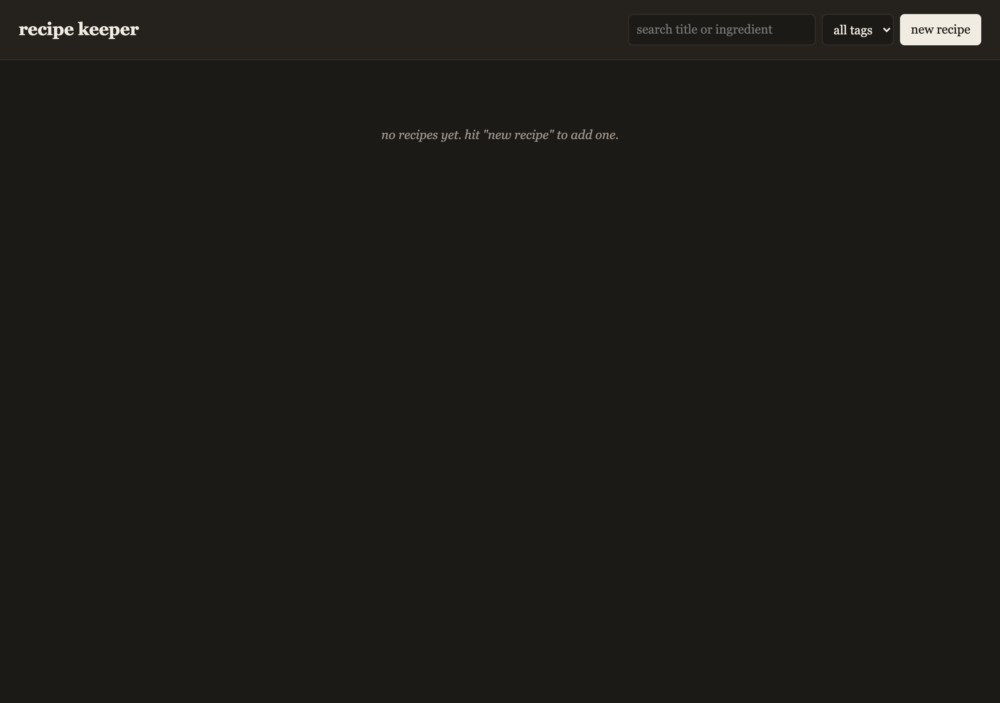

# recipe keeper



a small recipe app i built so i could stop having half my dinner ideas in screenshots and the other half on a notes app i never open.

it does the basics. you save a recipe with ingredients and steps, you can search by title or by ingredient, and there is a servings input on the recipe page that rescales the amounts. that last bit was the actual reason i made it. i kept doubling pasta recipes by hand and getting it wrong.

## what it does

- add a recipe with title, servings, ingredients (amount + unit + name), steps, tags, and a time in minutes
- scale the servings on the fly, ingredient amounts recompute
- search the list by title or ingredient name
- filter by tag
- print view (the topbar and scale box are hidden when you print)
- everything is in localStorage, no backend

## the scaling

nothing fancy. `factor = newServings / originalServings`, then each ingredient amount is multiplied by the factor. amounts are rounded to 2 decimals and trailing zeros are stripped, so `1.50` shows as `1.5` and `2.00` shows as `2`. steps and time are not touched, since "cook 10 min" does not actually scale linearly with portion size.

## run it

```
git clone https://github.com/secanakbulut/recipe-keeper.git
cd recipe-keeper
open index.html
```

no build step, no dependencies. any modern browser is fine. data lives in localStorage so different browsers will not share recipes.

## stack

vanilla html, css, js. one html file, one css file, one js file. that is it.

## file layout

- `index.html` - markup and the three views (list, form, detail)
- `style.css` - styling, including the print rules at the bottom
- `app.js` - state, render, form handling, scaling math

## license

PolyForm Noncommercial 1.0.0. fine for personal use, not for selling. see LICENSE.
